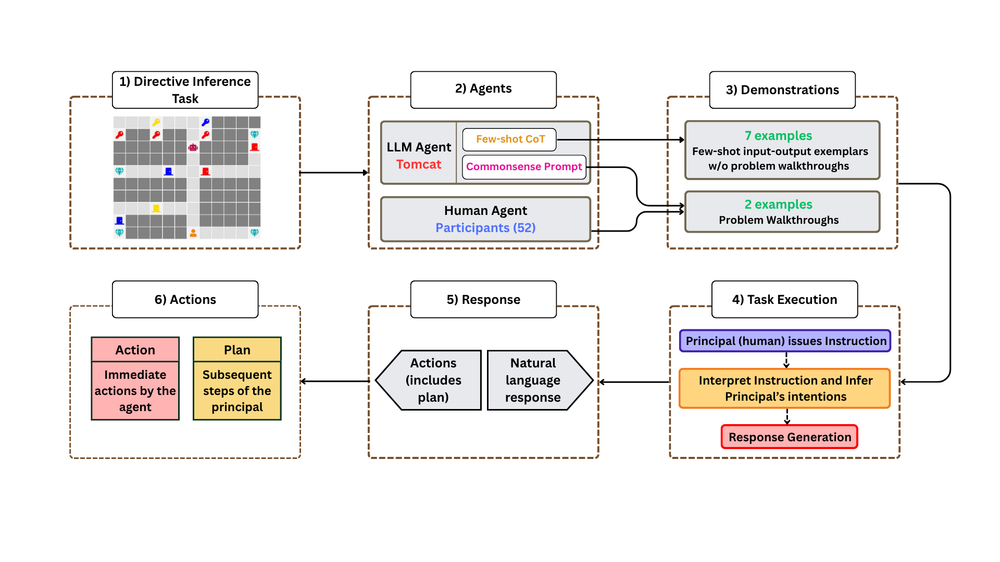

# Theory of Mind in Action: The Instruction Inference Task

This repository accompanies our paper introducing  a novel Theory of Mind (ToM) benchmark called _Instruction Inference_. We present **Tomcat**, an LLM-based agent, designed to collaborate with a principal (_simulated human_) on this _Instruction Inference_ task by interpreting ambiguous instructions in a dynamic, goal-driven environment. Unlike existing benchmarks focused on static vignettes or social narratives, our setup requires models to interpret directives (either clear or unclear), infer latent intent, and plan and execute actions that align with the principal's intent. 
We develop and evaluate two prompting variants of Tomcat:

- **Commonsense Prompt (CP):**  
  Leverages commonsense knowledge and task information, mirroring the instructions provided to **_human participants_**.

- **Few-shot Chain-of-Thought (Fs-CoT):**  
  Uses structured reasoning via **seven** (_k = 7_) input-output exemplars to guide the model's inference process.

The pipeline of our study is as follows:

<p align="center">
  
</p>


## Setup
This repository contains:
- `.env`: Contains the API key for all the LLMs.
- `llm.py`: Loads the GPT-4o API key.
- `deepseek.py`: Loads the DeepSeek-R1 API key.
- `gemma.py`: Loads the Gemma-3-27B API key.
- `env_setup.py`: Loads the dataset for different grid configurations.
- `agent.py`: Contains the Tomcat's framework and prompting techniques.
- `test_agent.ipynb`: Contains code for running the experiments.
>**Note:** The repo also contains the ToM task (Instruction Inference ToM task.pdf), results of the experiments (Results.xlsx), dataset, and csv files for storing the responses of the Tomcat variants (ToM_CP/FsCoT-dataset.csv) across the LLMs.

## 1. Configure the Environment

Before running the code, **ensure you set up your `.env` file** with ***your GPT-4o, DeepSeek-R1, Gemma-3-27B API keys***:

Make sure to replace `'Your API Key'` with your **actual API keys**.

## 2. Running the Code

Navigate to the `test_agent.ipynb` notebook and follow these steps:

### **Environment Setup:**
- Run the **first two cells** under the **"Environment Setup"** header to import the necessary Python files.
>**Note:** Use python kernel 3.12 or above for running the cells.

### 💻 **Experiments:**
Run the **six cells** under the **"Experiments"** section to execute the experiments across the LLMs. The six cells correspond to:

```
| Cell # | Model         | Prompting Technique |
|--------|---------------|---------------------|
|   1    | GPT-4o        | CP                  |
|   2    | GPT-4o        | Fs-CoT              |
|   3    | Gemma-3-27B   | CP                  |
|   4    | Gemma-3-27B   | Fs-CoT              |
|   5    | DeepSeek-R1   | CP                  |
|   6    | DeepSeek-R1   | Fs-CoT              |
```
  
  The results of the experiments will automatically be saved in:
  - `ToM_CP-dataset.csv` (for experiments ***using CP***)
  - `ToM_FsCoT-dataset.csv` (for experiments ***using Fs-CoT***)

### **Dataset Information:**
- The `dataset/problems` folder contains grid configurations. The code will automatically import the dataset required for the experiments.

## 3. Running Individual Commands

- For running individual commands, use the cell under the **"Individual Instruction"** header. 
- You can load different grid configurations and modify the instructions to test various cases and behaviors.

---

>**Note:** Make sure all necessary dependencies are installed and configured as per the project requirements. For instance, numpy, panda, openai, backoff, and python-dotenv.